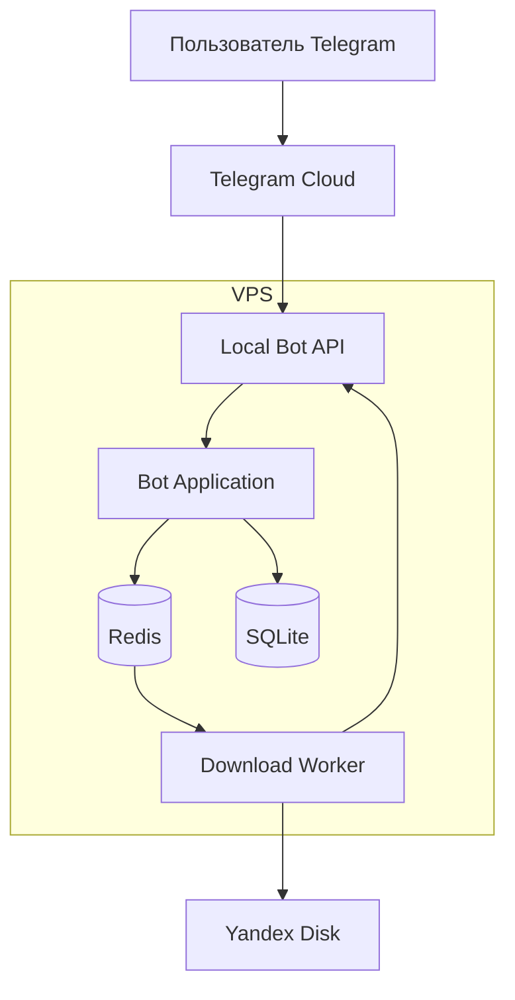
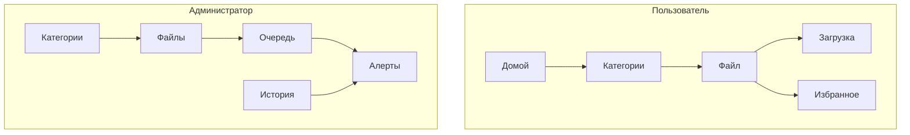

# PRD

> Этот файл является каноническим PRD. Обновляйте его *внутри этого пути*.
> Запрещено создавать дубликаты вроде PRD_v7.md.

## 0) Источник
Ниже включён текст PRD_v6 без смысловых правок (только добавлен заголовок/метаданные).


# **Adaspeas Docs**

## Product Requirements Document (PRD v6)

> *Adaspeas* — от *Per aspera ad astra*.
> Закрытая система доставки документов через Telegram. Без лишней магии, с контролем, очередями и вменяемым UX.

---

## 1. Цель системы

**Adaspeas Docs** — закрытая система распределённого хранения документов с доступом через Telegram.

### Ключевые цели:

* Скачивание файлов **напрямую в Telegram**
* Хранение файлов в **Yandex Disk**
* VPS как:

  * прокси,
  * контроллер очередей,
  * слой безопасности,
  * слой наблюдаемости
* Минимальный UX-шум, максимум предсказуемости

### SLA (целевые):

* Навигация: `< 500 ms`
* RTO (восстановление): `< 1 мин`
* Retry задач: до `3`
* Масштаб:

  * до `500` пользователей
  * до `10 000` файлов

---

## 2. Контекст и обоснование

* Telegram Bot API имеет лимиты на размер файлов
* **Local Bot API** требуется для файлов `> 50MB`
* Хранение в Yandex Disk:

  * дешевле,
  * снимает нагрузку с VPS
* Telegram используется как **UI + транспорт**
* VPS не хранит постоянные данные файлов

### ASSUMPTIONS

* Каждый пользователь имеет уникальный `chat_id`
* SQLite достаточно для текущих масштабов
* Redis используется для очередей и кеша
* Все интерфейсы Telegram — **строго на русском языке**

---

## 3. Пользовательские истории

### 3.1 Пользователь (User)

* Скачать файл из Telegram
* Навигироваться по категориям
* Видеть breadcrumb
* Искать файлы по имени
* Добавлять файлы в избранное
* Получать понятный прогресс загрузки
* Получать ошибки с объяснением
* Предложить файл администратору

### 3.2 Администратор (Admin)

* Управлять категориями и файлами
* Управлять пользователями и инвайтами
* Смотреть очередь задач
* Смотреть прогресс загрузок
* Просматривать историю действий
* Экспортировать журнал в CSV
* Получать алерты о сбоях

---

## 4. Функциональные требования

### 4.1 Навигация

* Древовидные категории
* Breadcrumb: `Домой > Категория > Подкатегория`
* Кнопки:

  * `[Домой]`
  * `[Назад]`
* Inline-поиск
* Избранное (Favorites)

---

### 4.2 Скачивание файлов

* Очередь задач
* Ограничение параллельных загрузок
* Streaming:

  * Yandex Disk → Local Bot API → Telegram
* Без постоянного хранения файлов на VPS
* Retry до 3 раз
* Ограничение размера файла: `≤ 2GB`
* Inline прогресс:

  * `Загрузка: 35%`
  * `Готово`
  * `Ошибка`

---

### 4.3 Администрирование

* Категории:

  * создать
  * переименовать
  * удалить (с подтверждением)
* Файлы:

  * загрузить
  * удалить
  * переименовать
* Пользователи:

  * инвайты
  * блокировка
* Audit Log:

  * user_id (hashed)
  * file_id
  * timestamp
  * status
  * reason
* `/history <user_id>`
* CSV-экспорт

---

### 4.4 Интеграции

* Yandex Disk API

  * OAuth refresh
* Telegram Local Bot API
* Redis:

  * очередь задач
  * кеш структуры
* SQLite:

  * пользователи
  * файлы
  * категории
  * избранное
  * audit log

---

### 4.5 Observability

* `/status`

  * состояние очереди
  * worker heartbeat
  * состояние YD API
* Алерты:

  * переполнение очереди
  * ошибки загрузок
  * протухший OAuth
* Логи:

  * структурированные
  * без PII

---

## 5. Нефункциональные требования

| Категория        | Требование                     |
| ---------------- | ------------------------------ |
| Надёжность       | graceful shutdown, recovery    |
| Безопасность     | защита от SQLi, path traversal |
| Privacy          | никаких PII в логах            |
| Масштабируемость | Redis queue + SQLite WAL       |
| Поддерживаемость | чёткие роли, простая модель    |

---

## 6. Архитектура (High-Level)



---

## 7. Edge Cases и Recovery

| Ситуация                     | Причина          | Реакция                |
| ---------------------------- | ---------------- | ---------------------- |
| Файл >2GB                    | Лимит Telegram   | Сообщение пользователю |
| Протух OAuth                 | YD token expired | Auto-refresh + алерт   |
| VPS упал                     | Crash            | Retry задач            |
| Два админа правят категорию  | Race             | DB lock                |
| Очередь переполнена          | Burst            | Throttle + алерт       |
| Пользователь закрыл Telegram | Нет callback     | Retry                  |
| GC не сработал               | Bug              | Плановая очистка       |

---

## 8. Роли и права

### Пользователь

* Навигация
* Скачивание
* Избранное
* Поиск
* Предложение контента

### Администратор

* Полный доступ
* Очереди
* История
* Пользователи
* Категории
* Алерты

---

## 9. Telegram UX (RU)

### Главный экран (User)

```
[Домой] [Категории] [Избранное] [Поиск]
```

### Просмотр файла

```
[Скачать] [В избранное] [Предложить админу]
```

### Прогресс

* `Загрузка: 45%`
* `Готово`
* `Ошибка: превышен лимит`

---

### Главный экран (Admin)

```
[Домой] [Категории] [Файлы] [Пользователи] [Очередь] [История] [Статус]
```

---

## 10. UX Flow Map (Mermaid)



---

## 11. Статус PRD

**PRD завершён.**
