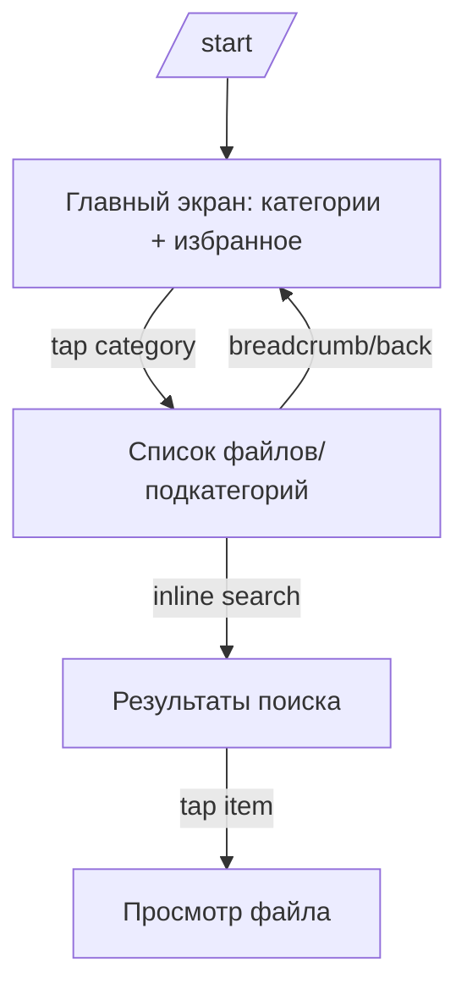
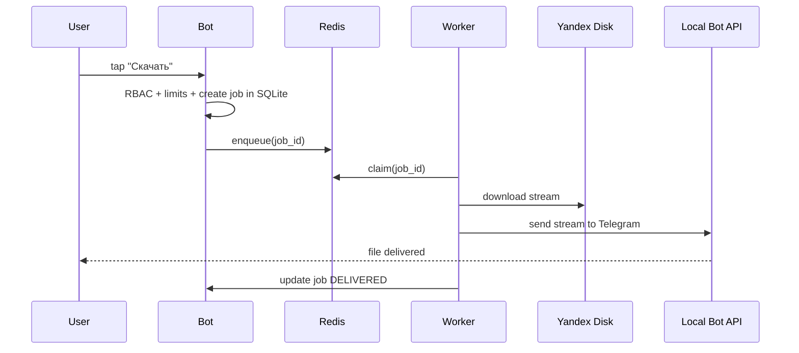

# User Flows

## 1) Navigation + search (User)

Acceptance:
- breadcrumb отражает путь
- назад возвращает в предыдущий список
- поиск не ломает навигацию (есть “очистить”)

## 2) Download (User)

## 3) Admin flows

- Управление категориями: create/rename/delete (confirm).
- Управление файлами: upload/delete/rename.
- Пользователи: invite code generation, block/unblock.
- /status: health snapshot.
