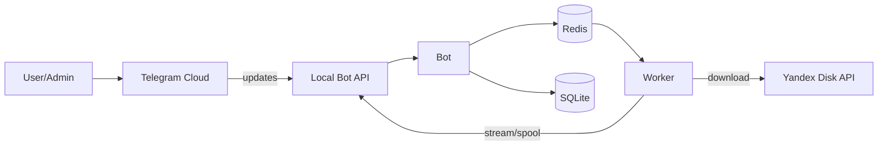

# Threat Model Lite

## 1) Контекст и границы доверия

Система доставляет документы пользователям Telegram из Yandex Disk, не сохраняя файлы на VPS постоянно (только потоковая передача / краткоживущий спул при необходимости).

Trust boundaries:

- **TB1: Telegram Cloud** (внешняя среда, входящие апдейты/коллбеки)
- **TB2: VPS** (Bot, Worker, Local Bot API, Redis, SQLite)
- **TB3: Yandex Disk API** (внешняя среда, OAuth, скачивание)

## 2) Активы (Assets)

- **Документы**: содержимое файлов, а также метаданные (имя, размер, категория).
- **OAuth секреты**: refresh/access tokens к Yandex Disk.
- **Идентичности/права**: chat_id, роли, инвайты, блокировки.
- **Очередь задач**: payload jobs (job_id, file_id, user_ctx).
- **База данных**: категории, файлы, избранное, audit log, состояние jobs.
- **Логи/метрики**: потенциальные утечки (PII/секреты) и “side-channel” (названия файлов).

## 3) Точки входа (Entry points)

- Telegram: команды и callbacks (inline-кнопки), текстовый поиск.
- Admin-команды: управление категориями/файлами/пользователями, `/status`.
- Worker: обработка job payload из очереди, обращения в YD API.
- Конфигурация/секреты: переменные окружения, файлы конфигов.

## 4) Угрозы и меры (Lite STRIDE)

| Угроза | Вектор | Влияние | Меры | Остаточный риск |
|---|---|---|---|---|
| Утечка OAuth токенов | логи, дампы, misconfig perms | полный доступ к YD | секреты только в env/secret-store, **никогда** в логах; redaction; минимальные права; ротация | средний |
| SQL Injection | поиск/параметры, админ поля | порча данных/эскалация | только параметризованные запросы, whitelist сортировок, ограничения длины | низкий |
| Path traversal / LFI | любые “пути” в payload | чтение файлов VPS | не принимать filesystem paths; работать только с file_id/yd_id; запрет произвольных URL | низкий |
| SSRF / злые URL | YD download URL подменён | доступ к внутренним ресурсам | скачивание только через официальный YD API; запрет внешних URL; allowlist доменов при редких исключениях | низкий |
| DoS очереди | бурст jobs, спам юзером | деградация, расходы | rate-limit на user/chat, queue size limit, backpressure + алерт, ограничение параллелизма | средний |
| Race admin операций | 2 админа правят одно | неконсистентность | транзакции, optimistic locking (version), уникальные ограничения, понятные ошибки | низкий |
| Leakage через логи | file names / chat_id | privacy инцидент | хешировать user_id, редактировать file names (опц.), запрет PII, sampling | средний |
| Подмена идентичности | чужой chat_id/инвайт | доступ к документам | инвайты одноразовые + TTL, привязка к chat_id при первом использовании, админские роли только вручную | низкий |
| Повторная обработка callback | retry Telegram | дубль выдачи | idempotency (request_id), dedup по (user,file,nonce) | низкий |

## 5) Security requirements (из PRD + дополнения)

1. Никаких PII/секретов в логах (user_id только hashed, токены никогда).
2. Валидация входных данных (длина, charset, whitelist).
3. Idempotency для callback/скачивания, retry ≤ 3.
4. Rate limiting на пользователя и глобально.
5. Хранение секретов: минимум прав, контроль доступа, ротация.
6. Audit log для admin действий и скачиваний (hashed user_id, file_id, action, ts).

## 6) Security test ideas

- SQLi: кавычки/комментарии/юникод в поиске и админ-именах.
- Path traversal: попытки передать `../`, абсолютные пути, URL схемы.
- DoS: 1000 быстрых enqueue; ожидание throttle + алертов.
- Token leak: grep по логам на “token”, “oauth”, “Bearer”.
- Privilege: user вызывает admin команды, ожидание deny.
