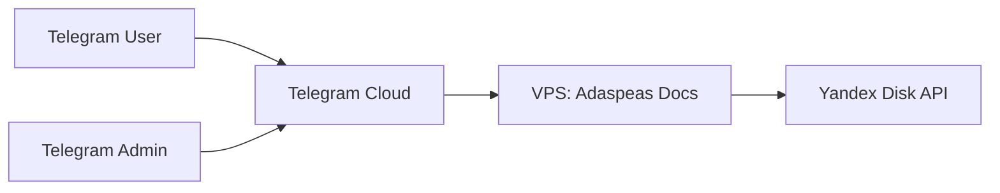
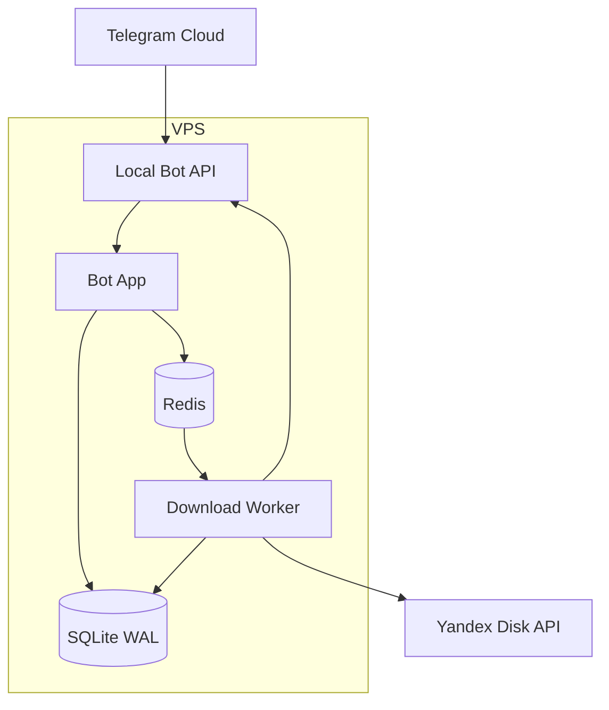

# Architecture Spec

## 0) Key constraints (из PRD)

- Навигация < 500ms (целевое).
- RTO < 1 мин (восстановление после падения).
- Retry задач: до 3.
- Файлы храним в Yandex Disk; **на VPS не храним постоянно**.
- Интеграции: Telegram (через Local Bot API), Redis queue, SQLite WAL.

## 1) C4: Context

Trust boundaries см. ThreatModelLite.

## 2) C4: Containers (VPS)

Роли контейнеров:
- **Bot App**: UX, маршрутизация команд, RBAC, чтение каталога, enqueue job.
- **Redis**: очередь jobs + кэш дерева категорий/файлов (ускорение навигации).
- **SQLite**: источник истины по сущностям (users/files/categories/favorites/audit/jobs).
- **Worker**: ограниченный параллелизм скачивания, retries, streaming/spool в Local Bot API.
- **Local Bot API**: проксирует взаимодействие с Telegram API (и снижает зависимость от внешнего latency).

## 3) Components (внутри Bot/Worker)

Bot:
- Router (commands/callbacks)
- Auth/RBAC (users, invites, admin checks)
- Catalog service (categories/files/breadcrumbs)
- Search service (prefix/substring, pagination)
- Favorites service
- Job scheduler (enqueue + idempotency)
- Status endpoint (/status)

Worker:
- Queue consumer (claim job)
- YD client (OAuth refresh, download)
- Delivery (stream/spool via Local Bot API)
- State updater (transactional updates в DB)
- Heartbeat publisher

## 4) Source of Truth & State

- **SQLite**: canonical data + job state machine.
- **Redis**: транспорт (queue) и кэш (каталог). Redis не считается источником истины, всё важное должно фиксироваться в SQLite.

Согласованность:
- Enqueue: Bot создаёт job запись в SQLite (QUEUED) → кладёт `job_id` в Redis.
- Worker: читает `job_id` → в SQLite делает `CLAIMED/RUNNING` (transaction) → выполняет работу.

## 5) Key data flows

### 5.1 Навигация
1) User нажимает кнопку/пишет команду.
2) Bot читает из Redis cache (если есть и валиден), иначе из SQLite.
3) Bot возвращает список элементов + breadcrumb.

### 5.2 Скачивание
1) User нажимает “Скачать”.
2) Bot проверяет права и лимиты → создаёт job.
3) Worker скачивает из YD и **стримит** в Local Bot API → Telegram.
4) При успехе фиксирует DELIVERED, иначе FAILED (retryable до 3).

### 5.3 Администрирование
- CRUD categories/files/users с транзакциями + audit log.

## 6) Reliability & Recovery

- Idempotency: ключ dedup для job (user_id, file_id, request_nonce).
- Retry policy: retryable errors (network, transient YD, Telegram timeouts) до 3; non-retryable (403, file too big, not found) без retry.
- Crash recovery: при старте Worker сканирует SQLite jobs в RUNNING/CLAIMED с протухшим heartbeat → возвращает в QUEUED (attempt++) или FAIL.
- graceful shutdown: Worker завершает текущий streaming или помечает job как RETRY_PENDING.

## 7) Performance

- Навигация: Redis cache дерева категорий + пагинация.
- Индексы SQLite под `parent_id`, `name`, `category_id`.
- Ограничение параллельных загрузок (configurable).

## 8) Security hooks

- input validation + RBAC
- secrets handling
- redaction in logs
(подробнее: ThreatModelLite, Privacy)

## 9) Open questions → ADR

- Queue source of truth (ADR-0001)
- Streaming vs spool (ADR-0002)
- Identity model (ADR-0003)
