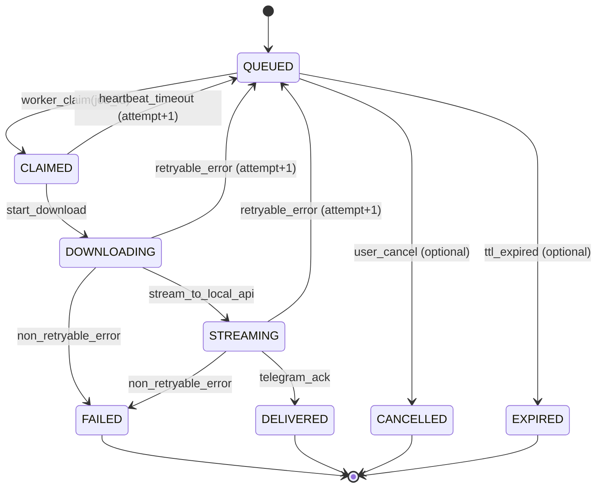

# State Machines

## 1) Job lifecycle

## 2) Transition rules (guard + side effects)

- `QUEUED -> CLAIMED`: атомарно (transaction) + записать `heartbeat_at`.
- `CLAIMED -> DOWNLOADING`: только если `attempt < 3` и пользователь ACTIVE.
- `DOWNLOADING/STREAMING -> QUEUED`: только retryable ошибки, `attempt++`, записать last_error.
- `... -> FAILED`: если `attempt >= 3` или ошибка non-retryable.
- Heartbeat: Worker обновляет `heartbeat_at` каждые N секунд в jobs; `/status` показывает “stuck” если heartbeat старее T.

## 3) Idempotency & Dedup

Idempotency key (пример):
`sha256(user_id + ":" + file_id + ":" + request_nonce)`.

- Bot генерирует nonce для каждого клика “Скачать”.
- Повторные callbacks с тем же nonce возвращают существующий job (без нового enqueue).

## 4) Error taxonomy

Retryable:
- network timeouts
- transient 5xx от YD/Telegram
- temporary rate limit (429) с backoff

Non-retryable:
- access denied (403) / user blocked
- file not found (404)
- file too big (> 2GB)
- invalid token after refresh (requires admin intervention)

## 5) Recovery after crash

- На старте worker: найти jobs в `CLAIMED/DOWNLOADING/STREAMING` с `heartbeat_at < now - T`:
  - если attempt < 3: вернуть в QUEUED (attempt++)
  - иначе FAILED
